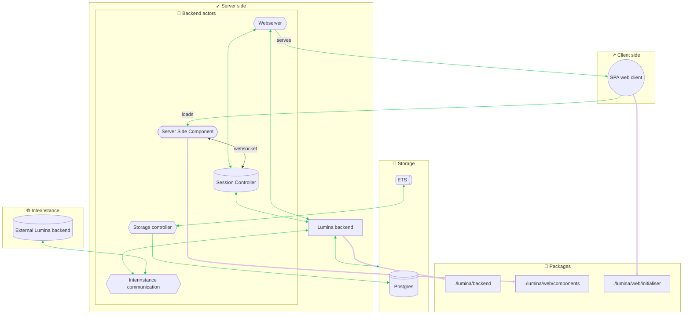

# Lumina(/peonies) server

> Notice:
> This project lives on [Radicle](https://radicle.network/nodes/rosa.radicle.network/rad%3Az3KozhW4C7ykQoe65DX8yUUGEHcdA), it is mirrored to [Tangled](https://tangled.org/strawmelonjuice.com/Lumina), [Codeberg](https://codeberg.org/strawmelonjuice/Lumina) (outdated) and a few
> other places, but the main development happens on Radicle.
> Please report issues and contribute on Radicle or Tangled, you may also request a contribution account for
> [my personal Forgejo](https://forge.strawmelonjuice.com/strawmelonjuice/Lumina).

Lumina is a project in development, as the short description says "Just trying out an old concept.". It is not in any
way ready for you to try. However, you are encouraged to contribute in any way!

Currently, as no stable is produced yet, code lives mainly in the `development` branch.


## Developing info

### Developing

Using the nix dev shell and the `just` task runner is recommended, as this ensures the environment is properly set.

> TIP:
>
> If you save a lot and prefer not to have the OTP Observer be restarted every time you save a file, try `unset LUMINA_DEBUG`.

```sh
just dev # Prepares your enviroment and builds/runs the server with file watching.
```

Run `just --list` to see all possible recipes.

When running Lumina server in development mode, it automatically creates two accounts for you and one of those has an attached
post on the global timeline.

| Username  | Email             | Password         |
| --------- | ----------------- | ---------------- |
| testuser1 | test@lumina123.co | MyTestPassw9292! |
| testuser2 | test@lumina234.co | MyTestPassw9292! |


### Package relationships (outdated)


